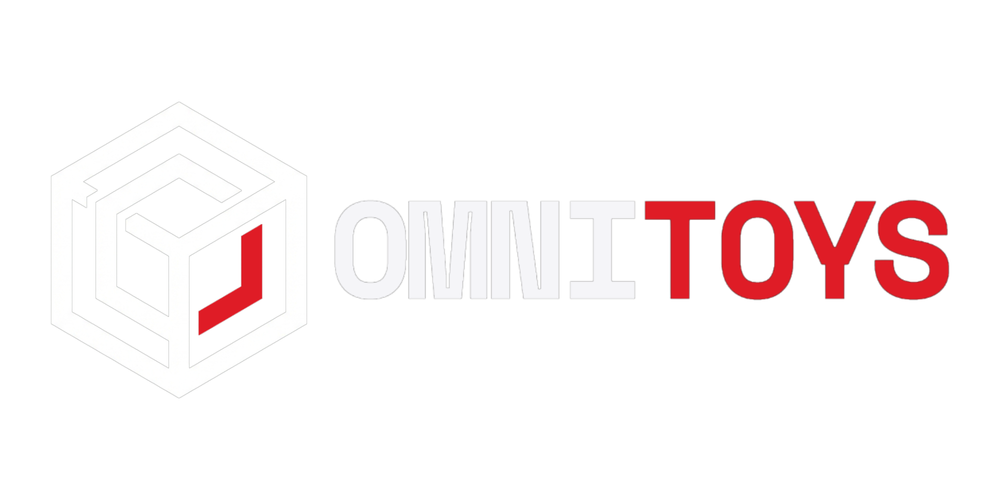

  

---

Yo! Welcome to **OMNITOYS**. This is my centralized personal toolbox where I'm regrouping every utility I actually need in one place.

**[→ Launch App](https://omnitoys.vercel.app/)**

> [!IMPORTANT]
> **OmniToys is currently a Work In Progress (WIP).** I am actively building out the modules. This means the project is still incomplete, and many planned tools and features are not yet available in the laboratory.

The goal is a "privacy-first" space. No tracking, no cloud nonsense, just local tools that work fast and look premium. I'm building this to center my workflow, but I'm sharing it here for anyone else who wants a cleaner dev experience.

- [**License**](LICENSE): Standard MIT stuff.

README will be updated soon too.

## 📦 Third-Party Libraries

OmniToys integrates the following open-source libraries. All licenses are permissive (MIT/BSD/Apache-2.0):

### Core Dependencies

- **React** (MIT) - UI framework
- **Vite** (MIT) - Build tool
- **React Router DOM** (MIT) - Client-side routing
- **Zustand** (MIT) - State management
- **Tailwind CSS** (MIT) - Styling
- **Framer Motion** (MIT) - Animations
- **Lucide React** (MIT) - Icons

### Code Editor

- **CodeMirror 6** (MIT) - Full-featured code editor with syntax highlighting

### Data & Format Tools

- **js-yaml** (MIT) - YAML parser and generator
- **sql-formatter** (MIT) - SQL query beautifier
- **SVGO** (MIT) - SVG optimizer
- **Terser** (BSD-2-Clause) - JavaScript minifier
- **clean-css** (MIT) - CSS minifier
- **html-minifier-terser** (MIT) - HTML minifier

### Developer Utilities

- **cron-parser** (MIT) - Cron expression parser
- **uuid** (MIT) - UUID generator
- **lorem-ipsum** (BSD-3-Clause) - Lorem ipsum text generator

### Existing Libraries

- **PrismJS** (MIT) - Syntax highlighting (legacy, being replaced by CodeMirror)
- **ColorThief** (MIT) - Color palette extraction
- **QRCode** (MIT) - QR code generation
- **Tesseract.js** (Apache-2.0) - OCR text extraction
- **fflate** (MIT) - Compression library
- **json-to-ts** (MIT) - JSON to TypeScript converter
- **react-easy-crop** (MIT) - Image cropping
- **react-image-crop** (MIT) - Advanced image cropping

### Full License Details

See individual `node_modules/*/LICENSE` files for complete license text.

All libraries are compatible with OmniToys' MIT license and do not impose additional restrictions on the use of this project.
